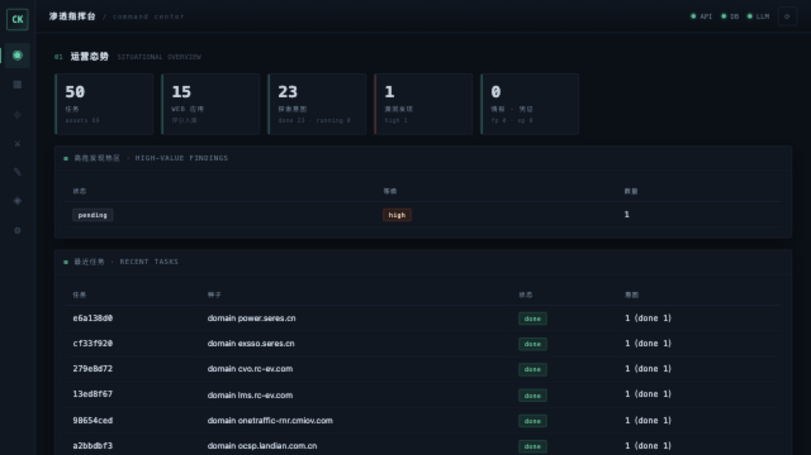
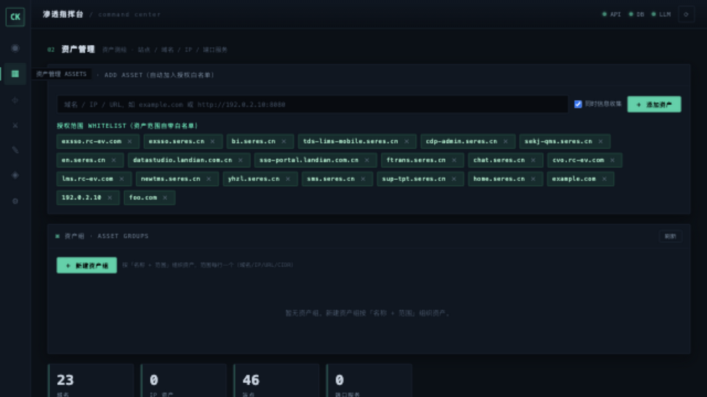
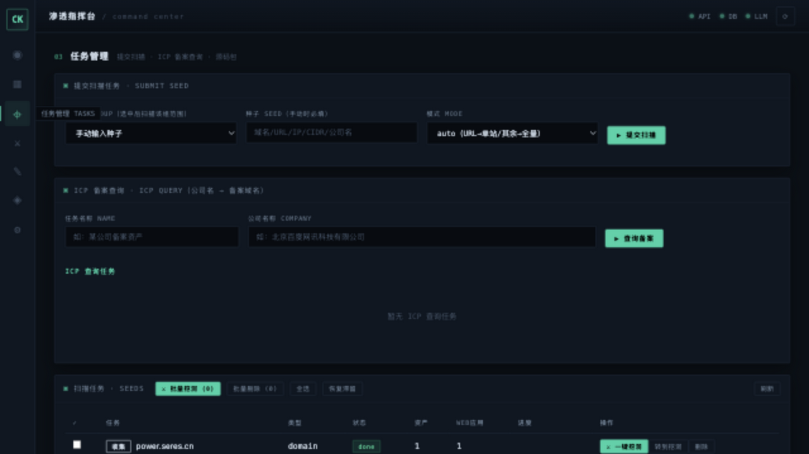
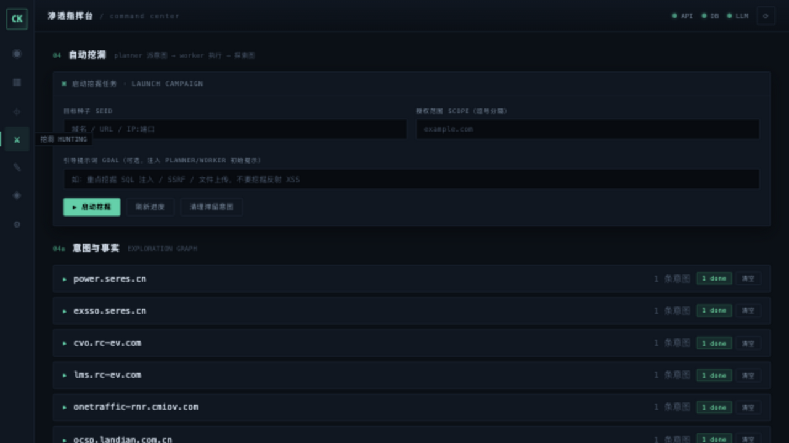
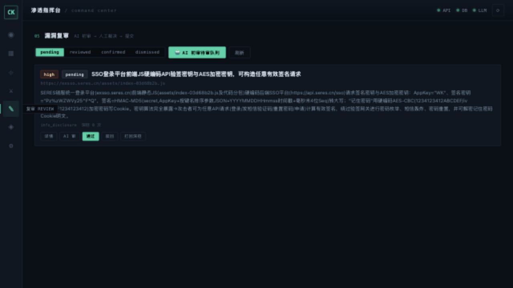

# ck-finder

[](https://github.com/zhaji2333/ck-finder/actions/workflows/ci.yml)
[](LICENSE)

基于 [pi](https://github.com/earendil-works/pi)（`@earendil-works/pi-agent-core`）的 **渗透测试 / SRC 漏洞挖掘 Agent** —— 内置确定性信息收集引擎 + LLM 决策编排 + 自动化验证 + 漏洞复审，一套闭环的混合架构。

> ⚠️ **仅限对已获明确授权的目标使用**。所有网络动作受 Scope Gate 与审批门约束，全程审计留痕。使用者需自行承担合规责任。

---

## 项目简介

ck-finder 把「**信息收集 → 资产管理 → 自动挖洞 → 漏洞复审 → 通杀分析**」整合成一个工具：

```
┌──────────────────────────────────────────────────────────────┐
│  ck-finder（单仓库）                                           │
│                                                                │
│  ① 收集引擎 src/recon/（确定性管道，不走 LLM）                  │
│     种子 → 子域/DNS/端口/httpx/指纹/FOFA/ICP → 评分 → 深挖 → 快照│
│                                                                │
│  ② Agent 编排层（pi）                                          │
│     planner（派意图）→ worker（挖到底）→ reviewer（复审）→ 报告 │
│                                                                │
│  ③ Web 指挥台 frontend/（Vue3 + Vite + TS）                    │
│     仪表盘 / 资产管理 / 任务管理 / 挖洞 / 复审 / 情报 / 设置      │
└──────────────────────────────────────────────────────────────┘
```

**核心理念**：**工具出数据，模型出决策** —— 收集走可靠管道（省 token），决策与验证走 LLM Agent（灵活），确定性验证与 LLM 互为兜底。

---

## 界面截图

| | |
| --- | --- |
|  |  |
| **仪表盘**（运营态势 / 高危热区 / 最近任务） | **资产管理**（资产组 / 白名单 / 站点域名IP端口） |
|  |  |
| **任务管理**（提交扫描 / ICP 查询 / 批量挖洞） | **自动挖洞**（站点 → 意图可折叠实时进度） |
|  | |
| **漏洞复审**（AI 初审 / 人工裁决 / 打回深挖） | |

## 核心特性

### 信息收集（ck-recon 引擎）
- 种子类型：域名 / URL / IP / CIDR / IP:端口 / 公司名
- 资产测绘：子域枚举（subfinder + OneForAll 双源）、DNS 解析、端口扫描（nmap/masscan）、Web 指纹（httpx）、FOFA 补充、**ICP 备案反查**（公司名 → 备案域名）
- 资产评分 + 角色识别（admin/backend/business/api/middleware/...）+ CVE 线索 + 攻击面地图
- 源码包还原（webpack/source-map）+ LLM 源码审计（硬编码密钥/隐藏接口/危险函数）

### 自动挖洞（Agent 编排）
- **planner** 信号驱动派意图（评分 + CVE 线索 + 登录页 + API 面），确定性选目标、LLM 增强
- **worker**「挖到底」循环（LLM 不终态就 continue 续跑），覆盖度纪律防漏攻击面
- 支持**引导提示词**（如「重点挖 SQL 注入/SSRF，不挖反射 XSS」）
- 支持**登录凭据注入**（cookie / 账密 / authorization）打后台漏洞
- **源码包审计**：worker 直接审计还原源码（`recon_source` / `recon_source_read`）
- **多目标并发直打**（`hunt` 命令，AutoHunter 同款 4 worker + 硬超时防卡死）

### 确定性验证（M3）
- http_req 手工重放 / nuclei 扫描 / sqlmap（**禁 `--dump` 脱库红线**）/ 目录爆破 / 弱口令（防锁护栏）
- finding 强制证据五件套：`poc` / `raw_request` / `raw_response` / `kill_chain` / `self_check`

### 复审与闭环（M4）
- Reviewer AI 初审（高危自动复现验证）→ 人工裁决（通过/驳回/打回深挖）
- 确认后自动提炼情报（指纹/端点/凭证）→ intel 库跨任务复用
- `report` 导出 Markdown 报告（含复现 POC/攻击链/原始请求响应）
- `killsweep` 通杀分析（确认漏洞 → 提取产品指纹 → FOFA 圈同款站点）

### 规模化（M5）
- 持久化任务队列（心跳 + 崩溃恢复 + 预算控制，7×24 挂机）
- LLM 端点池（多 provider 负载均衡 + 失败熔断）
- Docker Compose 一键部署

### Web 指挥台（Vue3 单页应用）
7 个 Tab：**仪表盘 / 资产管理（资产组+白名单）/ 任务管理（扫描+ICP）/ 挖洞 / 复审 / 情报 / 设置**，全流程可视化操作。

---

## 项目优势

| 维度 | ck-finder | AutoHunter | 鸾鸟（luann1ao） |
| --- | --- | --- | --- |
| **许可证** | **MIT**（私有部署自由） | 开源 | AGPL（有传染性） |
| **架构** | **混合**：确定性收集 + LLM 决策 + 确定性验证兜底 | 纯 LLM 编排 | LLM 编排 |
| **收集引擎** | 内置（子域/DNS/端口/指纹/FOFA/ICP/评分/源码还原） | 依赖外部 | 依赖外部 |
| **前端** | Vue3 现代化指挥台（资产组/白名单/一键挖洞/批量操作） | — | — |
| **安全红线** | R1-R6 硬约束（禁改删/禁脱库/只读验证）+ Scope Gate + 全量审计 | 部分 | 部分 |
| **源码审计** | worker 直接审计还原源码找密钥/隐藏接口 | — | — |
| **确定性验证** | nuclei/sqlmap/dirsearch + 证据五件套，LLM 失效时仍能挖 | 部分 | 部分 |
| **生态** | 复用 pi（MIT）Agent 运行时 | 自研 | 自研 |

**一句话**：把 AutoHunter 的「信号驱动挖洞」、鸾鸟的「Agent 编排」、ck-recon 的「确定性收集」、以及一套现代化 Vue3 指挥台 + 安全红线，整合成一个 MIT 许可的单仓库工具。

---

## 快速开始

### 前置依赖
- Node.js ≥ 22.19
- PostgreSQL 16 + Redis（推荐用 Docker Compose 起）
- 可选：nuclei / sqlmap / dirsearch（M3 确定性验证用）

### 1. 安装依赖

```bash
npm install
```

### 2. 配置

```bash
cp .env.example .env
```

编辑 `.env`，至少填：

```ini
DEEPSEEK_API_KEY=sk-xxxxxxxx          # LLM 密钥（可选，未填则 LLM 环节降级纯规则）
DEEPSEEK_BASE_URL=https://api.deepseek.com/v1
CKFINDER_MODEL=deepseek-chat
CKFINDER_SCOPE=example.com            # 授权范围（逗号分隔：域名/IP/CIDR）
```

### 3. 启动基础设施

```bash
docker compose up -d postgres redis icp   # PostgreSQL + Redis + ICP 备案查询
npm run migrate                            # 数据库迁移（幂等，14 个迁移）
```

### 4. 环境自检

```bash
npm run dev -- doctor    # 环境自检（Node / Key / PG / Redis / 工具链）
npm run dev -- recon     # 收集引擎自检（PG/Redis + 数据概览）
```

### 5. 启动 Web 指挥台

```bash
npm run dev -- server    # REST API(8787) + Web 指挥台
```

打开 <http://localhost:8787/> 即可使用。

---

## 部署方式

### 方式 A：本地部署（开发/单机）

```bash
npm install
cp .env.example .env                     # 填配置
docker compose up -d postgres redis icp  # 或自建 PG/Redis
npm run migrate

# 生产前端构建（Vue3 指挥台，构建到 frontend/dist/）
npm run web:build

# 启动后端（serve 前端 dist）
npm run server
```

开发前端（热更新）：

```bash
npm run web:dev     # Vite dev server :5173，代理后端 :8787
```

### 方式 B：Docker Compose 一键部署

```bash
cp .env.example .env   # 填 DEEPSEEK_API_KEY + CKFINDER_SCOPE
docker compose up -d --build
```

`docker-compose.yml` 会启动：PostgreSQL、Redis、ICP 查询服务、ck-finder（内置 nuclei/sqlmap/dirsearch）。镜像多阶段构建：后端 TS 编译 + 前端 Vite 打包 → 运行时镜像内置安全工具链。

---

## 使用流程

**信息收集 → 资产管理 → 挖洞 → 复审 → 通杀** 的完整闭环：

1. **资产管理**：添加资产（域名/IP/URL，自动进白名单）→ 新建资产组（名称 + 范围，回车分割）
2. **任务管理**：选资产组/手动提交扫描 → ICP 备案查询（公司名反查域名）
3. **一键挖洞**：任务列表「⚔ 一键挖洞」/ 资产管理勾选「⚔ 批量挖洞」→ 后台 planner+worker 并发挖
4. **挖洞页**：站点 → 意图 可折叠列表，实时轮询进度，可「清空」重挖
5. **复审**：AI 初审 → 人工通过/驳回/打回深挖
6. **通杀**：`killsweep` 对确认漏洞圈定同款产品站点

---

## 命令行参考

```bash
# 挖洞（收集驱动：收集 → planner → worker）
ck-finder run --target example.com --scope "example.com,*.example.com" [--goal "重点挖SQL注入"]

# 直打（免收集，多目标并发）
ck-finder hunt --targets "http://a.com,http://b.com" [--concurrency 4] [--queue]

# 确定性验证（不走 LLM）
ck-finder verify --target 192.0.2.10:8080 --scope 192.0.2.10 [--auth-brute]

# 查看漏洞 / 图 / 复审 / 报告 / 通杀
ck-finder findings [seedId]
ck-finder graph [seedId]
ck-finder review [pending|reviewed|confirmed|dismissed]
ck-finder report [seedId] [--out report.md] [--all]
ck-finder killsweep

# 队列（7×24 挂机）
ck-finder queue          # 启动常驻 worker
ck-finder queue status   # 查看队列状态

# 其他
ck-finder doctor         # 环境自检
ck-finder recon          # 收集引擎自检
ck-finder migrate        # 数据库迁移
ck-finder scan|score|deep-scan|sources|metadata|query|fofa|health ...   # 收集引擎命令
```

---

## 安全红线（硬约束）

所有挖洞行为受以下红线约束，违反即拦截：

| 红线 | 内容 |
| --- | --- |
| **R1** | 禁止修改 / 删除目标数据 |
| **R2** | 禁止脱库（sqlmap 禁用 `--dump` 等参数） |
| **R3** | 禁止破坏性命令 |
| **R4** | 越权操作只读少量样本 |
| **R5** | 验证只做存在性证明（不扩大危害） |
| **R6** | 文件上传验证仅允许无害回显文件 |

配套机制：
- **Scope Gate**：所有网络工具（web_fetch/http_req/nuclei/sqlmap/dir_brute/auth_brute）目标强制校验授权范围，越权 fail-closed
- **SSRF 云元数据探测**：白名单放行云厂商元数据端点（169.254.169.254 等）用于盲 SSRF 存在性证明
- **全量审计**：每次工具调用 / Scope 决策 / LLM 调用写 `audit_log`
- **工具参数 guard**：sqlmap 等危险参数运行时拦截

---

## 目录结构

```
src/
├── index.ts          # 统一 CLI 入口
├── controller.ts     # 任务编排（收集 + planner/worker 循环 + 预算 + 崩溃恢复）
├── hunt.ts           # 直接打目标挖洞（免收集 + 并发 + 凭据注入 + 硬超时）
├── queue.ts          # 持久化任务队列（心跳 + 崩溃恢复）
├── verify.ts         # 确定性漏洞验证
├── doctor.ts         # 环境自检
├── agent/session.ts  # pi Agent 封装 + 审计
├── agents/           # planner / worker / reviewer / escalate / killsweep / playbook
├── graph/store.ts    # 探索图（intents/facts/activities）
├── security/         # Scope Gate + 审计 + scope 工具
├── llm/provider.ts   # DeepSeek provider + 端点池熔断
├── tools/            # pi AgentTool（recon_* / http_req / nuclei / sqlmap / brute / skill）
├── validation/       # finding 证据校验 / dedup / 报告 / intel / review
└── recon/            # ★ 收集引擎（原 ck-recon）
    ├── config.ts     #   唯一配置源 getConfig()
    ├── pipeline/     #   确定性收集管道 + 源码收集/审计
    ├── scoring/      #   评分 + 快照
    ├── storage/      #   PG/Redis + models + query 查询层
    └── api/          #   REST / MCP / Web
frontend/             # ★ Web 指挥台（Vue3 + Vite + TS）
    ├── src/api.ts    #   统一 API 层
    ├── src/views/    #   7 个视图组件
    └── src/components/
skills/               # AGENTS 方法论技能库（14 个 SKILL，worker 按需加载）
migrations/           # 14 个 SQL 迁移
docs/                 # 架构决策 / 开发计划 / 对比借鉴
docker-compose.yml    # PG + Redis + ICP + ck-finder
test/                 # 152 个测试（vitest）
```

---

## 里程碑

- ✅ **M1** 收集引擎（ck-recon）并入，6 个 recon_* 工具进程内调用
- ✅ **M2** 图驱动 Agent 内核：探索图 + planner/worker + Scope Gate + 审计 + 技能库
- ✅ **M3** 验证工具链：http_req/nuclei/sqlmap/弱口令/目录爆破 + 证据五件套 + dedup + 红线
- ✅ **M4** SRC 闭环：Reviewer 初审 + deepen 回炉 + 指挥台 + intel + escalate + 报告
- ✅ **M5** 规模化：任务队列 + 多目标并发 + 凭据注入 + LLM 端点池 + Docker + killsweep

---

## License

[MIT](LICENSE)

本项目基于 pi（MIT）与若干开源组件构建。仅限授权安全测试 / SRC 漏洞挖掘 / 教学研究使用，禁止用于任何未授权攻击。
